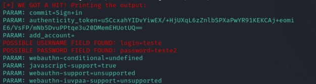

# Phishing to catch Facebook passwords

### Tools

- Kali Linux
- setoolkit

### Setting up Phishing in Kali Linux

- Root Access: `sudo su `
- Starting setoolkit: `setoolkit `
- Attack type: `Social-Engineering Attacks `
- Attack vector: `Web Site Attack Vectors `
- Attack method: `Credential Harvester Attack Method `
- Attack method: `Site Cloner `
- Obtaining the machine address: `ifconfig `
- Clone URL: http://www.facebook.com

### Results

---

# Phishing para captura de senhas do Facebook [PT-BR]

### Ferramentas

- Kali Linux
- setoolkit

### Configurando o Phishing no Kali Linux

- Acesso root: `sudo su `
- Iniciando o setoolkit: `setoolkit `
- Tipo de ataque: `Social-Engineering Attacks `
- Vetor de ataque: `Web Site Attack Vectors `
- Método de ataque: `Credential Harvester Attack Method `
- Método de ataque: `Site Cloner `
- Obtendo o endereço da máquina: `ifconfig `
- URL para clone: http://www.facebook.com

### Resutados

